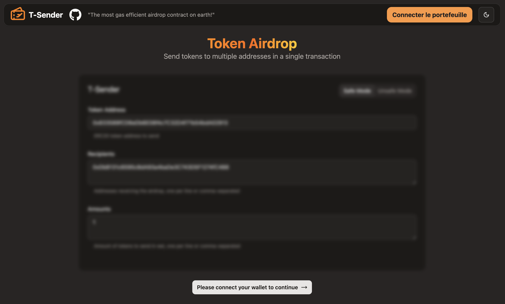
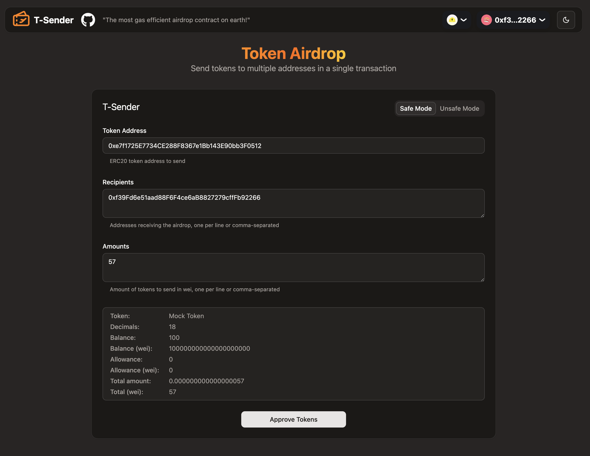
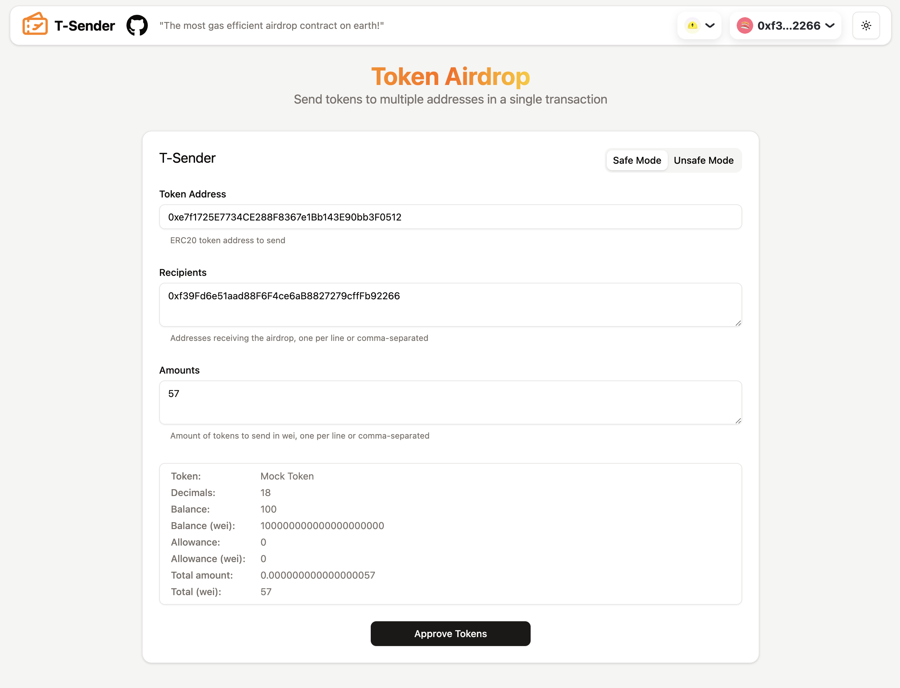
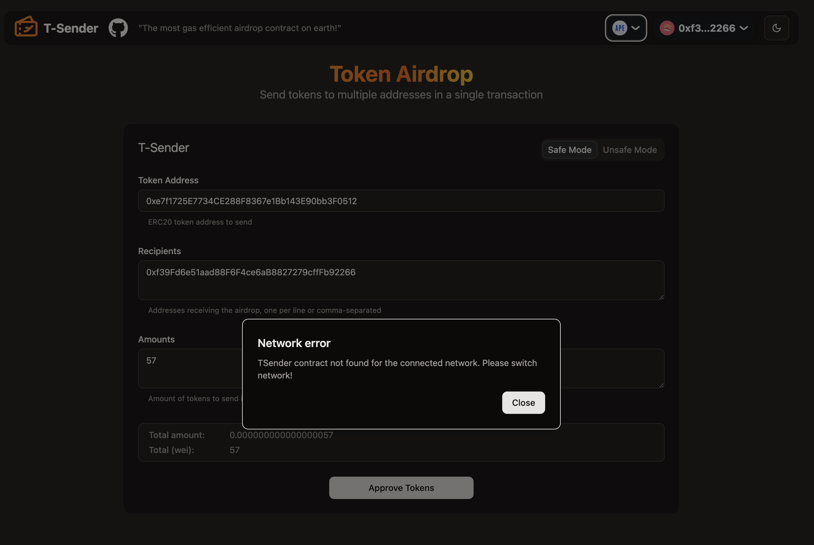
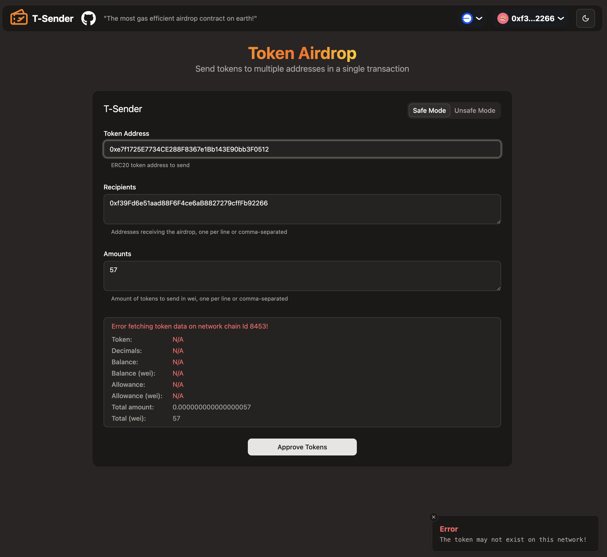
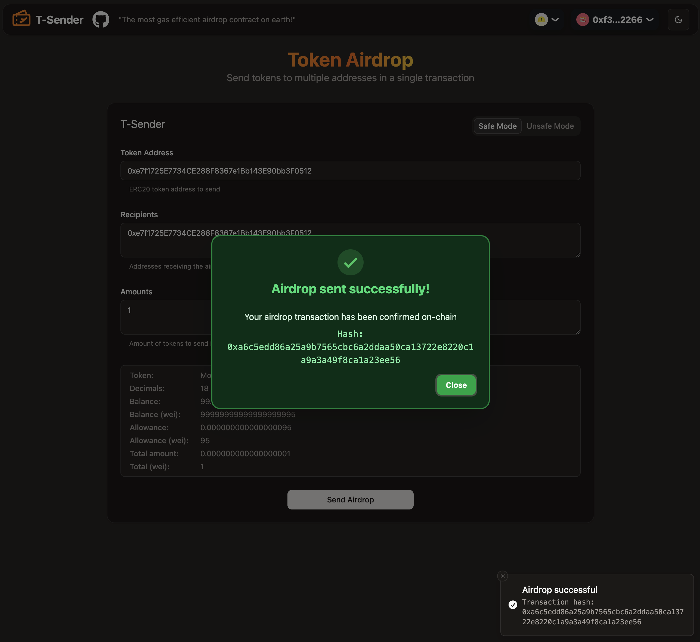

# 📬 TSender UI

_Modern Web3 frontend to manage EVM airdrop transactions with a clean, fast UI._

## ✨ Description

**TSender UI** is a next-gen React interface to send ERC20 airdrops to multiple addresses in a single transaction — across multiple EVM chains.

Built for speed, clarity, and power: advanced validation, instant feedback, light/dark mode, and a design system based on **shadcn/ui** + **Tailwind CSS**.

## 🎨 Technologies Used

- ⚛️ **[React 19](https://react.dev/)** – JavaScript library for building user interfaces
- 🧠 **[TypeScript](https://www.typescriptlang.org/)** – Typed JavaScript for better DX and maintainability
- ⚡ **[Vite](https://vitejs.dev/)** – Lightning-fast frontend build tool
- 💨 **[Tailwind CSS v4](https://tailwindcss.com/)** – Utility-first CSS framework
- 🎨 **[shadcn/ui](https://ui.shadcn.dev/)** – Beautifully styled and accessible components using Radix UI + Tailwind CSS
- 🦄 **[RainbowKit](https://www.rainbowkit.com/)** – Wallet connector for Web3 dApps
- ⚙️ **[wagmi](https://wagmi.sh/)** + **[viem](https://viem.sh/)** – Modern Web3 libraries for interacting with EVM
- 🧪 **[Vitest](https://vitest.dev/)** – Ultra-fast testing framework
- 📏 **[zod](https://zod.dev/)** – Type-safe schema validation
- 🪝 **[react-hook-form](https://react-hook-form.com/)** – Performant declarative form management
- 🧱 **[clsx](https://github.com/lukeed/clsx)**, **[tailwind-merge](https://github.com/dcastil/tailwind-merge)** & **[class-variance-authority](https://cva.style/)** – Utility tools for optimized Tailwind class composition

## 📸 Previews

<p align="center">
  
  &nbsp;&nbsp;
  
  &nbsp;&nbsp;
  
  &nbsp;&nbsp;
  
  &nbsp;&nbsp;
  
  &nbsp;&nbsp;
  
</p>

## ✅ Core Features

- 🔐 **Connect Wallet** – Powered by RainbowKit + wagmi
- 🪙 **Token Detection** – Detects name, decimals, balance, and allowance
- 🧾 **Approval Flow** – Handles ERC20 approvals for batch transfers
- ✈️ **Airdrop Engine** – Batch send with validation and live feedback
- 🧮 **Address & Amount Validation** – Powered by zod and custom helpers
- 🔥 **Instant Feedback** – Toasts, loading states, and error messaging
- 🛡️ **Basic Security Checks** – Validation and network enforcement
- 🌐 **Network Support** – Ethereum, Base, Arbitrum, Optimism, Anvil, and more
- 🌘 **Dark & Light Mode** – Fully themeable via next-themes
- 💾 **Form Persistence** – Saves input state to localStorage
- 🚨 **Error Handling** – Clean toasts, modals, and edge-case handling

## 🔧 Installation & Setup

1️⃣ **Clone the repository**

```sh
git clone https://github.com/silent7-x/tsender-ui
cd tsender-ui
```

2️⃣ **Install dependencies**

```sh
pnpm install
```

3️⃣ **Set up your environment variables**

Copy the provided .env.example file and fill in your credentials:

```sh
cp .env.example .env
```

4️⃣ **Run the project**

```sh
pnpm run dev
```

5️⃣ **Open in your browser**

Vite will start a local server. Open **[http://localhost:5173/](http://localhost:5173/)** in your browser.

## 🌟 Contributing

Feel free to contribute! Fork the repo and submit a PR if you have improvements.

## 📩 Contact

💻 GitHub: [@silen7-x](https://github.com/silent7-x)

🐦 Twitter: [@silen7_x](https://x.com/silen7_x)
